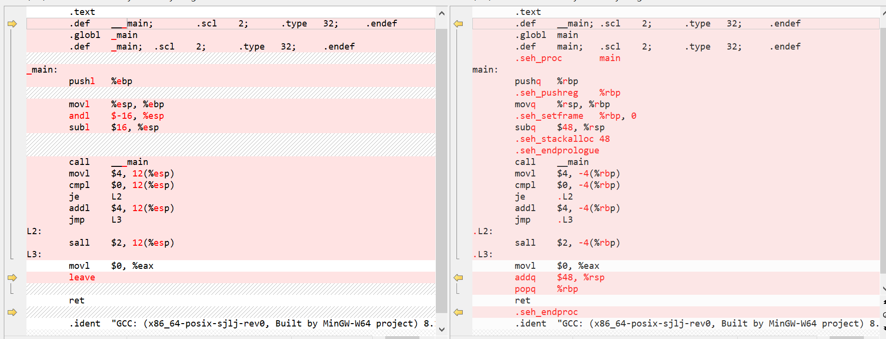

## 认识编译器-GCC相关操作练习

### 问题解答

- 1.1：如果在命令⾏下执⾏`gcc -DNEG -E sample.c -o sample.i`⽣成的`sample.i`与之前的有何区别？
  - 添加`-DNEG`参数后，宏M的引用被展开成`-4`
- 1.2：请对⽐`sample-32.s`和`sample.s`，找出它们的区别，并上⽹检索给出产⽣这些区别的原因。如：`pushq`和`pushl`，`rsp`和`esp`
  - 区别如图，主要体现在出入栈时后缀的变化（`l`和`q`）
  - 区别产生原因主要是操作系统架构和位数的不同，如：`pushq`是于将一个64位的寄存器或内存地址中的数据推入栈中，而`pushl`则用于32位；`rsp`是 x86_64 64位操作模式下使用的寄存器，而`esp`是 x86 32位操作模式下使用的寄存器
- 1.3：